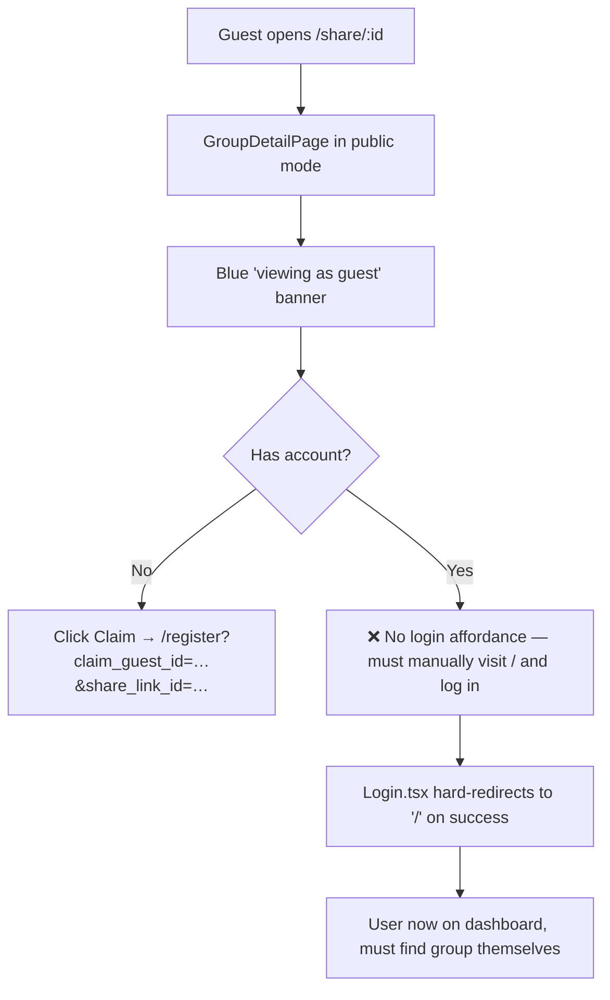
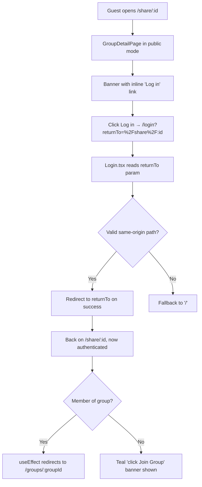

# Plan: Login affordance on public group share page

## Working Protocol
- Use parallel subagents only if implementation grows; this task is small enough to do directly.
- Mark steps done as you complete them so a fresh agent can resume.
- Run `npm run build` and `npm run test` from `frontend/` after the code changes.
- If blocked (e.g., a redirect mechanism conflicts with `AuthContext` behavior), document the blocker here before stopping.

## Overview
Add a "Log in" link to the guest banner on the public group share page (`/share/:shareLinkId`) so users who already have an account can sign in without manually navigating to the root URL. After login, return them to the share page; existing logic on `GroupDetailPage` will then auto-route them to the authenticated group view if they're a member.

## User Experience

Guest viewer flow on `/share/:shareLinkId` (not logged in):

1. Guest visits `splitwiser.fly.dev/share/71060`. The blue banner now reads:
   *"You are viewing this group as a guest. To join, find your name in the **Members** list below and click **Claim** — or **Log in** if you already have an account."*
2. Guest clicks **Log in** → navigates to `/login?returnTo=%2Fshare%2F71060`.
3. Guest signs in via email/password or Google. On success, they're redirected back to `/share/71060` instead of `/`.
4. Once authenticated on the share page, the existing `useEffect` in `GroupDetailPage` decides:
   - If they're a member of the group → redirected to `/groups/:groupId` (full authenticated view).
   - If not a member → they stay on the share page and see the existing teal banner: *"You are viewing this public group. Click the **Join Group** button below to get full access."*

No change for authenticated users, users without a guest banner, or the Claim flow.

## Architecture

### Current

`Login.tsx` always sets `window.location.href = '/'` on success (lines 27 and 56). `Register.tsx` already supports `claim_guest_id` + `share_link_id` URL params, but `Login.tsx` reads no params at all. There's no return-URL mechanism anywhere in the auth flow.

### Proposed

Runtime walkthrough:

1. The login link is rendered client-side by `GroupDetailPage` using a `react-router` `Link` with the current `pathname` URL-encoded into a `returnTo` query string. No backend or storage involvement.
2. `Login.tsx` reads the `returnTo` param via `useSearchParams` (already a pattern in `Register.tsx`). It passes the value through a small validator (`safeReturnTo`) that only allows same-origin relative paths starting with a single `/` (rejecting protocol-relative `//evil.com`, absolute URLs, and any value with `://`). This prevents open-redirect.
3. On successful login (email/password OR Google), `Login.tsx` and `GoogleSignInButton`'s `onSuccess` handler use the validated path for `window.location.href` instead of the hardcoded `'/'`.
4. After redirect, the share page's existing useEffect (`GroupDetailPage.tsx:348-357`) handles the membership check and may redirect to `/groups/:groupId`. No new logic is needed there.

State persistence: none — the `returnTo` lives only in the URL across the login round-trip. Tokens land in `localStorage` as today.

## Current State

- `frontend/src/GroupDetailPage.tsx:692-701` — guest/public banners.
- `frontend/src/GroupDetailPage.tsx:348-357` — useEffect that auto-redirects authenticated members from `/share/:id` to `/groups/:groupId`. **We rely on this; do not change it.**
- `frontend/src/Login.tsx:27,56` — hardcoded `window.location.href = '/'` on success (Google + email/password).
- `frontend/src/Register.tsx:24-25` — already uses `useSearchParams` to read `claim_guest_id` and `share_link_id`. Same pattern is reused for `returnTo`.
- `frontend/src/components/auth/GoogleSignInButton.tsx` — calls `onSuccess` after Google auth; the redirect happens in the parent's handler.
- `frontend/src/AuthContext.tsx:125` — `window.location.href = '/login'` on logout. Out of scope.

## Proposed Changes

**Strategy**: minimum change. Add a single inline `<Link>` to the guest banner, wire a `returnTo` query param through `Login.tsx`, and validate it with a small helper.

- `GroupDetailPage.tsx`: append "— or **Log in** if you already have an account." to the existing guest banner. Use `react-router`'s `Link` with `to={`/login?returnTo=${encodeURIComponent(location.pathname)}`}`.
- `Login.tsx`: read `returnTo` via `useSearchParams`, pass through `safeReturnTo()` validator, redirect there on both success paths (email/password and Google).
- New helper `frontend/src/utils/safeReturnTo.ts` — pure function, easy to unit-test, prevents open-redirect.

Why this approach over alternatives:
- A header "Log in" button was rejected (user picked inline). Inline keeps the affordance contextual — right next to the explanation of why they're a guest.
- Extending Claim to log-in-then-claim was rejected as out of scope.
- A `useNavigate` instead of `window.location.href` would skip a full page reload, but `Login.tsx` already uses `window.location.href` to ensure auth state is rebooted; matching that pattern avoids regressions in `AuthContext` rehydration.

### Complexity Assessment

**Trivial → Low.** Three files touched (`GroupDetailPage.tsx`, `Login.tsx`, new `safeReturnTo.ts` + its test). One new pure helper. No backend changes. No new patterns — `useSearchParams` is already used in `Register.tsx`. Main risk: open-redirect if validation is wrong, mitigated by the validator + tests. No data migrations, no schema changes.

## Impact Analysis

- **New Files**:
  - `frontend/src/utils/safeReturnTo.ts`
  - `frontend/src/utils/__tests__/safeReturnTo.test.ts`
- **Modified Files**:
  - `frontend/src/GroupDetailPage.tsx` (banner copy + Link)
  - `frontend/src/Login.tsx` (read + honor `returnTo`)
- **Dependencies**: `react-router-dom` (already in use). No new packages.
- **Similar Modules**:
  - `Register.tsx:24-25` — `useSearchParams` reading auth-related params. Same pattern.
  - The `GoogleSignInButton`'s `onSuccess` handler in `Login.tsx:20-28` — it also hardcodes `'/'`. Update both success paths together.

## Key Decisions

- **Same-origin validation only** — rejecting protocol-relative URLs and absolute URLs. We never honor `returnTo` values that aren't a single-leading-slash path. No allow-list of paths beyond that; any internal route is fine.
- **Don't touch `AuthContext.logout`'s `/login` redirect** — that's a separate, unrelated flow.
- **Don't change Login.tsx's full-page reload** — keep `window.location.href`, just change the destination. This preserves whatever side effects the rest of the app expects from a fresh load post-login.

## Implementation Steps

### Step 1: Add `safeReturnTo` helper
- [x] Create `frontend/src/utils/safeReturnTo.ts` exporting `safeReturnTo(value: string | null | undefined, fallback = '/'): string`.
- [x] Accept a value only if it's a string, starts with `/`, doesn't start with `//` or `/\\`, and contains no `://`. Otherwise return `fallback`.

### Step 2: Honor `returnTo` in Login
- [x] In `frontend/src/Login.tsx`, import `useSearchParams` from `react-router-dom` and the new `safeReturnTo` helper.
- [x] Read `returnTo` once at the top of the component; compute `const target = safeReturnTo(searchParams.get('returnTo'))`.
- [x] Replace `window.location.href = '/'` on line 27 (Google success) with `window.location.href = target`.
- [x] Replace `window.location.href = '/'` on line 56 (email/password success) with `window.location.href = target`.

### Step 3: Add Login link to guest banner
- [x] In `frontend/src/GroupDetailPage.tsx`, import `Link` from `react-router-dom` if not already imported.
- [x] Update the banner block at lines 692-696. Append: `— or <Link to={`/login?returnTo=${encodeURIComponent(location.pathname)}`} className="underline font-medium">log in</Link> if you already have an account.`
- [x] Use `useLocation()` (already used elsewhere or import) to get `pathname`. If `useLocation` isn't already imported, add it.

### Step 4: Write tests
- [x] Create `frontend/src/utils/__tests__/safeReturnTo.test.ts`.
- [x] Test cases (each one assertion).
- [x] Run `npm run test` from `frontend/`. (99/99 passing.)

### Step 5: Manual verification
- [ ] Build frontend: `cd frontend && npm run build` — confirm no TS errors.
- [ ] Run dev server, open `/share/<some-share-id>` in an incognito window, confirm banner now shows the inline **log in** link.
- [ ] Click it; confirm URL becomes `/login?returnTo=%2Fshare%2F<id>`.
- [ ] Log in with a known existing account.
- [ ] If the account is a member of that group → land on `/groups/:groupId`. Otherwise → back on `/share/:id` with the teal "Join Group" banner.
- [ ] Verify the Google sign-in button on the same login page also honors `returnTo`.
- [ ] Sanity check: visiting `/login?returnTo=https://evil.com` and logging in lands on `/`, not the malicious URL.

## Acceptance Criteria
- [ ] [test] `safeReturnTo` rejects protocol-relative, absolute, and non-leading-slash inputs and accepts internal paths.
- [ ] [test-manual] Public share page (`/share/:id`) shows an inline "log in" link in the guest banner when not authenticated.
- [ ] [test-manual] Clicking "log in" lands on `/login?returnTo=%2Fshare%2F:id`.
- [ ] [test-manual] Successful email/password login from that page redirects back to `/share/:id` (not `/`).
- [ ] [test-manual] Successful Google login from that page redirects back to `/share/:id` (not `/`).
- [ ] [test-manual] After login, if the user is a member of the group, they end up on `/groups/:groupId` thanks to the existing redirect effect.
- [ ] [test-manual] `/login?returnTo=https://evil.com` → after login, lands on `/`, not the malicious URL.

## Edge Cases
- **`returnTo` is missing/empty** → fall back to `/` (matches current behavior).
- **`returnTo` is malicious (open-redirect)** → fall back to `/`.
- **User already logged in when they hit `/login?returnTo=...`** → out of scope; today's `Login.tsx` doesn't redirect logged-in users away. Don't change that behavior in this PR.
- **User logs in but isn't a member of the group** → `GroupDetailPage`'s existing logic shows the "Join Group" teal banner; no new code needed.
- **Page reload via `window.location.href`** keeps the `returnTo` mechanism single-shot — no risk of looping.
