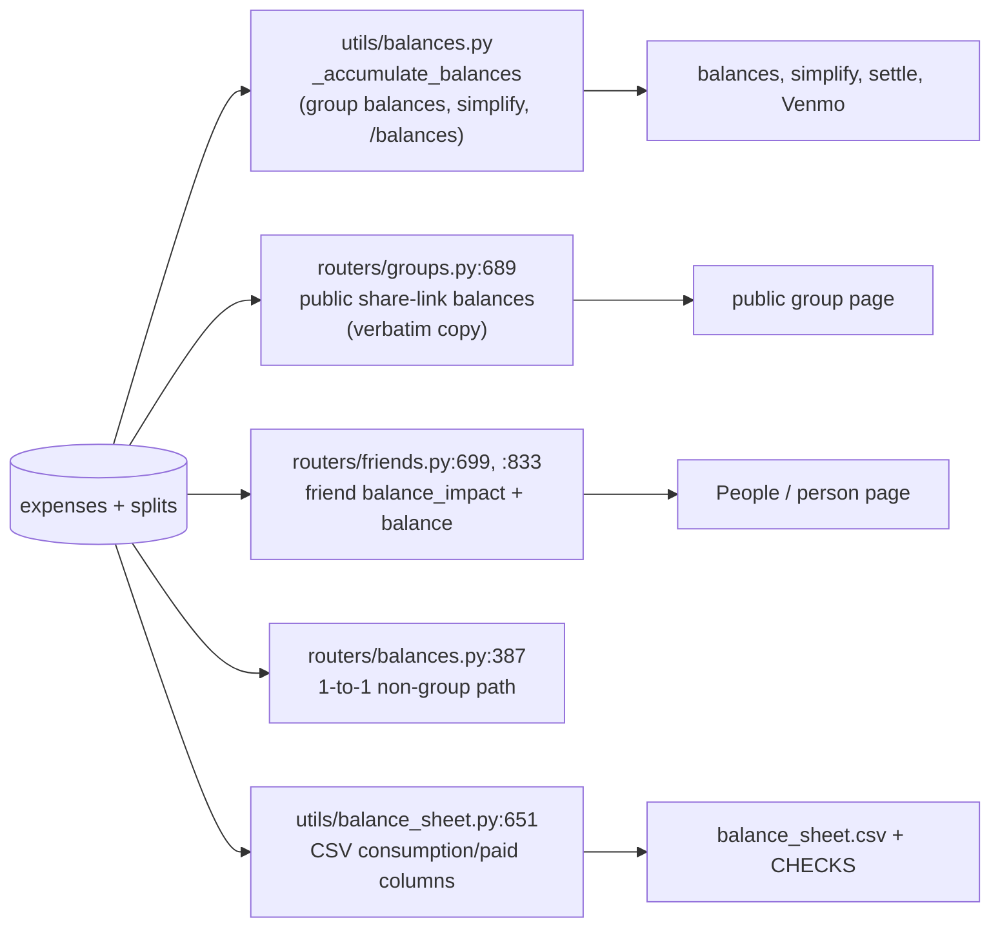
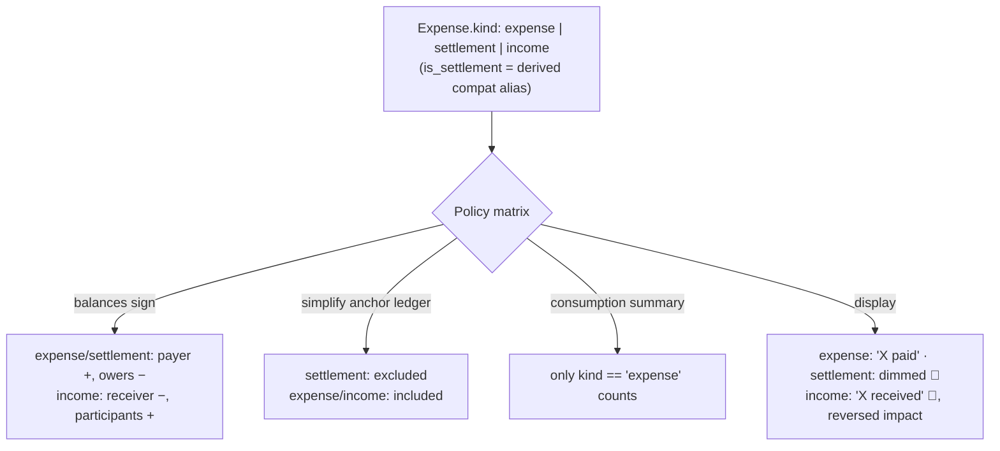

# Plan: Money Received (group income)

## Working Protocol
- Use parallel subagents for independent tasks (reading, searching, implementing across files)
- Mark steps done as you complete them — a fresh agent should be able to find where to resume
- Run tests after each step before moving on (backend + frontend suites both pass today)
- If blocked, document the blocker here before stopping

## Overview
Add the dual of an expense: one person **received** money that belongs to the group (a refund after settling off-platform, a returned security deposit, a reimbursement, sold leftover tickets). Stored as an ordinary expense row with positive amounts; the sign flips at aggregation, so the receiver ends up owing the split participants. As part of this, the `is_settlement` boolean is generalized into a three-state `kind` column (`expense | settlement | income`), with `is_settlement` kept as a compat alias for stale PWA clients.

## User Experience

1. **Entry**: In the Add Expense modal, a SegmentedControl at the top toggles **Expense | Money received**. On mobile, the FAB sheet gains a "Money received" row (next to "Settle up") that opens the modal pre-toggled.
2. **Form in income mode**: title becomes "Money received"; "Paid by:" becomes "Received by:"; the receipt Scan button, the ITEMIZED split pill, and the settlement checkbox are hidden. Group select, currency, date, notes, participants, and the remaining split types (EQUAL/EXACT/PERCENTAGE/SHARES) work exactly as for expenses. Works for groups and for non-group 1-to-1 entries with friends.
3. **Result**: the receiver's balance goes down by the others' shares; each split participant's balance goes up by their share. Example: Eliz receives a $200 Airbnb refund split equally among 4 → Eliz −$150, each other +$50.
4. **Feed**: income rows appear in the normal feed (and under the "Expenses" filter bucket on the group page — no filter UI change). Copy reads "Eliz received" instead of "Eliz paid"; row icon falls back to 💸; the per-row impact line shows the reversed sign ("you're owed +$50"), colored by Money's existing `auto` tone.
5. **Detail modal**: "Paid by" → "Received by", "Split breakdown" → "Shared among". Editing round-trips the kind; quick-settle for expense guests is hidden for income.
6. **Downstream**: balances, simplify debts, settle up, and Venmo hand-off all just work (they read net balances). The spending summary does **not** count income as consumption. The balance-sheet CSV shows income rows in the EXPENSES section with a "money received" note and still reconciles in CHECKS.

## Architecture

### Current

An expense row credits its payer and debits each split participant. `is_settlement` is a boolean read in scattered places: excluded from the simplify anchor ledger, excluded from consumption summary, rendered dimmed with a 🏦 icon. **The debit/credit loop is duplicated in five places**, only one of which is the "real" one:

### Proposed

One `kind` column drives a small per-kind policy matrix; every ledger loop applies `sign = -1 if kind == 'income' else +1`:

**Data flow for the flip**: a "Money received" entry posts through the existing `POST /expenses` path (`kind: "income"`, positive `amount`, positive `splits`). Split computation, validation, exchange-rate capture, and storage are unchanged — positive numbers everywhere, so none of the cents-remainder/floor-division code is exposed to negatives. The sign exists **only** at the five aggregation sites, applied per expense inside each loop. Nothing is cached between requests beyond what exists today; the PWA's IndexedDB stores expense objects verbatim (spread), so `kind` flows through offline create/update/sync with no storage changes.

**Compat (stale PWA clients)**: responses carry both `kind` and the derived `is_settlement`. Writes accept either: missing `kind` is derived from `is_settlement`; contradictory values (`kind="income"` + `is_settlement=true`) are rejected with 400. Known accepted edge: a stale client *editing* an income entry would send no `kind` and `is_settlement=false`, downgrading it to a plain expense — stale clients can't render income anyway, and the window closes when bundles cycle.

## Current State

Mapped in detail (file:line) during exploration:

- **Backend flag reads**: `models.py:95`; `schemas.py:151/:168/:214`; anchor filter `utils/balances.py:379-382`, settlements filter `:540-541`; consumption SQL filter `utils/summary.py:217` (`!= True` — drops NULLs, so new column must be `NOT NULL DEFAULT`); balance sheet note `utils/balance_sheet.py:432`, per-split accumulation `:651-670` (presettlement gated at `:661-663`), CHECKS incl. `matches_balances_endpoint` `:979-993`; create passthrough `routers/expenses.py:114`, update `:709` (**footgun: PUT that omits the flag silently clears it** — `ExpenseUpdate.is_settlement` defaults False); tab close hardcodes `is_settlement=False` at `routers/tabs.py:892`.
- **Duplicated ledger loops** (each needs the sign flip): `utils/balances.py:446-458` (scalar) and `:463-480` (multi-currency); `routers/groups.py:689-708` (public balances — no settlement handling today); `routers/friends.py:699-720` and `:833-855` (friend paths include group expenses, so these flips are mandatory regardless of UI scope); `routers/balances.py:387-405` (1-to-1); `utils/balance_sheet.py:651-670`. (`check_balances.py:25-41` is a debug script — update opportunistically.)
- **Migrations**: no startup column-adds; the live path is `start.sh:10-15` running `python migrations/<name>.py --db-path "$DATABASE_PATH"`. Modern template: `migrations/add_tab_offapp_payer.py` (PRAGMA check, idempotent `run_migration(db_path, dry_run)`, argparse). `tests/test_startup_migrations.py` requires 4 tests per migration including "start.sh contains the exact invocation line".
- **Frontend flag reads**: types `types/expense.ts:88/:137`, `hooks/useGroupData.ts:29`, `hooks/useExpenseFeed.ts:15`; feed `components/group/GroupExpenseList.tsx:51/:63/:75/:94`; `components/ExpenseFeedRow.tsx:36/:54`; `components/group/OpenExpensePane.tsx:70/:113`; filter `routes/GroupPage.tsx:126-128`; payer copy in `routes/GroupPage.tsx:111-121`, `routes/PublicGroupPage.tsx:50-55`, `hooks/useExpenseLabels.ts:25-33`, `routes/PersonPage.tsx:128-132`, `ExpenseDetailModal.tsx:274-283`; writers `AddExpenseModal.tsx:88/:243/:393/:424/:909-919`, `ExpenseDetailModal.tsx:115/:246/:451/:475/:736-746`; `utils/settleAmount.ts:165-195` (`settlementExpense`) and the inline copy in `SettleUpModal.tsx:104-117`.
- **Sign-sensitive frontend code**: only `utils/expenseImpact.ts:34-59` (`iPaid ? amount - myShare : -myShare`). `expenseCalculations.ts` and `expenseTransformations.ts` are direction-agnostic over positive cents. Money (`components/ui/Money.tsx`) shows totals unsigned via `Math.abs`; impact rows use `sign="always" tone="auto"` — income needs no Money changes.
- **Modal structure**: header `AddExpenseModal.tsx:767-786`, settlement checkbox `:909-919`, "Paid by:" `:1058-1102`, split pills `:1104-1106`, two payload builders `:378-394` and `:408-425`; global entry via `AppShell.tsx:46/:142-145`, `layouts/shellActions.ts:10-15`, `layouts/FabSheet.tsx` (rows at `:61-102`); `components/ui/SegmentedControl.tsx` is the house either/or control.
- **Offline**: `services/offlineApi.ts` / `syncManager.ts` spread objects verbatim; `db/schema.ts:69-89` `CachedExpense` already omits `is_settlement` and works (Dexie stores whole objects) — adding `kind?` is type cleanup only.

## Proposed Changes

**Why `kind` instead of a second boolean**: two booleans encode an illegal fourth state every reader must guard; the three kinds carry distinct *policies* (anchor inclusion, consumption, display), which one enum centralizes. `split_type` is existing precedent for a string-enum column. Migrating later would cost strictly more (two columns to collapse, double-flag guards to unwind).

**Why sign-flip at aggregation instead of negative storage**: the cents-remainder code (`allocate_items`, equal-split rounding) uses floor-division semantics never tested with negatives; keeping stored amounts positive means split validation ("splits sum to amount") and all computation paths work verbatim. The flip is ~2 lines per ledger loop.

**Why no linkage to a parent expense**: when the original expense is in the group, editing it down to net (+ a note) is the correct record. Linked refunds would add caps, per-item remaining amounts, and reversed tax/tip allocation to produce a worse version of an edit. Standalone income has no parent allocation to unwind.

**Semantics decisions**:
- Income is **included in the simplify anchor ledger** (sign-flipped). The anchor exists so recording a *payment* doesn't re-pair the plan; income is a real ledger event like an expense, not a payment.
- Consumption summary counts **only `kind == 'expense'`** (income is not consumption; replaces the `is_settlement != True` filter).
- Balance sheet: income rows appear in EXPENSES with note "money received"; their consumption/paid/presettlement contributions are sign-flipped so `net = paid − consumed` still matches the balances endpoint and all CHECKS reconcile.
- Validation: `kind='income'` requires `amount > 0`; contradictory `kind`/`is_settlement` combinations → 400; ITEMIZED split type rejected for income (UI hides it; backend enforces).
- Tab close writes `kind='expense'` explicitly.

### Complexity Assessment
**Medium-high.** ~12 backend files and ~15 frontend files, but almost all changes follow the existing `is_settlement` grooves; no new patterns beyond the enum + compat alias. The risk concentrates in (a) the five duplicated ledger loops — missing one silently desynchronizes a surface (mitigated by the balance sheet's `matches_balances_endpoint` check and parity tests), and (b) write-path compat normalization (mitigated by dedicated old-payload tests). The migration is a routine additive column with the established template. Frontend work is broad but shallow: copy, one sign flip, one toggle.

## Impact Analysis

- **New Files**:
  - `backend/migrations/add_expense_kind.py`
  - `frontend/src/utils/expenseKind.ts` (tiny helpers: `expenseKind(e)` deriving kind with compat fallback, `isIncome(e)`, shared label copy)
- **Modified Files** (backend): `models.py`, `schemas.py`, `routers/expenses.py`, `routers/balances.py`, `routers/groups.py`, `routers/friends.py`, `routers/tabs.py`, `utils/balances.py`, `utils/summary.py`, `utils/balance_sheet.py`, `start.sh`, (`check_balances.py` opportunistic)
- **Modified Files** (frontend): `types/expense.ts`, `hooks/useGroupData.ts`, `hooks/useExpenseFeed.ts`, `utils/expenseImpact.ts`, `utils/settleAmount.ts`, `SettleUpModal.tsx`, `AddExpenseModal.tsx`, `ExpenseDetailModal.tsx`, `components/group/GroupExpenseList.tsx`, `components/ExpenseFeedRow.tsx`, `components/group/OpenExpensePane.tsx`, `routes/GroupPage.tsx`, `routes/PublicGroupPage.tsx`, `routes/PersonPage.tsx`, `hooks/useExpenseLabels.ts`, `layouts/AppShell.tsx`, `layouts/shellActions.ts`, `layouts/FabSheet.tsx`, `db/schema.ts` (type cleanup)
- **Dependencies**: relies on the existing expense CRUD, split validation, exchange-rate capture, offline sync (payloads flow verbatim), and `SegmentedControl`. Everything downstream of net balances (simplify, settle, Venmo, OffPlanPaymentSheet) needs **no changes**.
- **Similar Modules**: `is_settlement` is the template throughout — reuse its exclusion sites, its feed-row variant rendering, and `settlementExpense` as the payload-shaping precedent. Reuse `SegmentedControl` (house either/or), `impactLabel`/`expenseImpact` (extend, don't fork). Migration mirrors `add_tab_offapp_payer.py`.

## Key Decisions

1. `kind` enum (`expense | settlement | income`) with backfill; `is_settlement` retained as derived compat alias at the serialization edge only; drop the column + alias in a later cleanup once PWA bundles cycle.
2. Positive stored amounts; sign applied per-expense in each of the five ledger loops.
3. No parent-expense linkage; in-group refunds remain "edit the expense down + note".
4. Income **in** simplify anchors, **out** of consumption summary.
5. Naming: **"Money received"**; form labels "Received by" / "Shared among".
6. Entry: SegmentedControl in Add Expense modal **plus** FAB-sheet row.
7. Scope: groups **and** 1-to-1 friend entries (backend flips are mandatory either way).
8. Feed: income lives in the "Expenses" filter bucket (filter becomes `kind !== 'settlement'`).
9. ITEMIZED not offered for income in v1 (UI hidden, backend 400); EXACT covers item-specific cases manually.
10. Stale-client edit of an income entry downgrades it to expense — accepted, documented in schema comment.

## Implementation Steps

### Step 1: Migration + model + schema compat layer
- [x] Create `backend/migrations/add_expense_kind.py` from the `add_tab_offapp_payer.py` template: add `kind TEXT NOT NULL DEFAULT 'expense'`, backfill `UPDATE expenses SET kind='settlement' WHERE is_settlement=1`, idempotent, `--dry-run`/`--db-path`
- [x] Add the invocation line to `start.sh` (exact-format, matching the existing lines)
- [x] `backend/models.py`: add `kind = Column(String, nullable=False, default="expense")` beside `is_settlement` (comment: compat alias, drop later)
- [x] `backend/schemas.py`: add `kind` to `ExpenseCreate`/`ExpenseUpdate`/`Expense`; model validator normalizing kind↔is_settlement (derive missing kind, 400 on contradiction); responses serialize both
- [x] `backend/routers/expenses.py`: create/update write `kind` (and mirrored `is_settlement`); fix the PUT-clears footgun by normalizing from whichever field the client sent; validate income: `amount > 0`, split type ≠ ITEMIZED
- [x] `backend/routers/tabs.py:892`: write `kind="expense"` explicitly

### Step 2: Backend aggregation sign flips (all five loops)
- [x] `utils/balances.py:446-480`: `sign = -1 if expense.kind == "income" else 1` in both loop modes; switch `is_settlement` reads at `:379-382` and `:540-541` to `kind == "settlement"` (income stays in anchors)
- [x] `routers/groups.py:689-708` (public balances loop): same flip
- [x] `routers/friends.py:699-720` and `:833-855`: same flip; serialize `kind` in `FriendExpenseWithSplits`
- [x] `routers/balances.py:387-405` (1-to-1 path): same flip
- [x] `utils/summary.py:217`: filter becomes `models.Expense.kind == "expense"`
- [x] `utils/balance_sheet.py`: note "money received" at `:432`; sign-flip income in the `:651-670` accumulation (consumption/paid/target/conv **and** presettlement); confirm all CHECKS reconcile
- [x] (opportunistic) `check_balances.py:25-41`

### Step 3: Frontend types + entry points
- [x] `types/expense.ts`, `hooks/useGroupData.ts:29`, `hooks/useExpenseFeed.ts:15`, `db/schema.ts` (`CachedExpense` cleanup): add `kind?: 'expense' | 'settlement' | 'income'`
- [x] New `utils/expenseKind.ts`: `expenseKind(e)` (fallback: `is_settlement` → settlement, else expense), `isIncome`, `isSettlement`; migrate existing `is_settlement` reads to it
- [x] `AddExpenseModal.tsx`: `initialKind` prop; SegmentedControl (Expense | Money received) below header `:787`; income mode hides Scan, ITEMIZED pill, settlement checkbox; labels "Money received"/"Received by:"; `kind` in both payload builders and `resetForm`
- [x] `layouts/AppShell.tsx` + `layouts/shellActions.ts` + `layouts/FabSheet.tsx`: `kind` in the modal-open state, "Money received" FAB row; GroupPage/PersonPage modal mounts pass it through
- [x] `utils/settleAmount.ts` `settlementExpense` + `SettleUpModal.tsx:104-117`: add `kind: 'settlement'` (keep `is_settlement` for compat)

### Step 4: Frontend display
- [x] `utils/expenseImpact.ts`: negate impact for income
- [x] `components/group/GroupExpenseList.tsx`: income row — 💸 icon fallback, "received" subtitle copy, keep impact line (reversed sign flows from expenseImpact), no dimming
- [x] `components/ExpenseFeedRow.tsx`, `components/group/OpenExpensePane.tsx`: income icon + copy variants
- [x] Payer copy sites → "X received": `routes/GroupPage.tsx:111-121`, `routes/PublicGroupPage.tsx:50-55`, `hooks/useExpenseLabels.ts:25-33`, `routes/PersonPage.tsx:128-132`
- [x] `ExpenseDetailModal.tsx`: view labels ("Received by", "Shared among"), edit round-trips `kind`, hide quick-settle for income
- [x] `routes/GroupPage.tsx:126-128`: expenses bucket filter → `kind !== 'settlement'`

### Step 5: Write Tests
- [x] `backend/tests/test_startup_migrations.py`: the four standard migration tests for `add_expense_kind` (adds + idempotent; backfills settlements; dry-run writes nothing; start.sh line present)
- [x] `backend/tests/test_balances.py`: income scenario — receiver R, N participants: receiver −R(N−1)/N, others +R/N; group balances, `/balances`, and simplify all agree; income entry does not destabilize an existing simplify plan (extend `test_settlement_stability.py` pattern)
- [x] Parity tests: public share-link balances and friend balance for a group containing an income expense match the group-balances endpoint
- [x] 1-to-1: non-group income expense flips sign in `/balances` and friend balance
- [x] `backend/tests/test_summary_aggregation.py`: income excluded from consumption (member totals and series)
- [x] Balance sheet: group with income row → all CHECKS pass incl. `matches_balances_endpoint`; EXPENSES note says "money received"
- [x] Write-path compat: legacy payload (`is_settlement` only, no `kind`) still creates a settlement; contradiction → 400; income with ITEMIZED or `amount <= 0` → 400; PUT without `kind` on an income expense (stale-client downgrade — pin the documented behavior)
- [x] `frontend/src/utils/__tests__/expenseImpact.test.ts`: reversed sign for income (payer and participant perspectives)
- [x] `frontend` component tests: AddExpenseModal income mode (labels, hidden controls, payload carries `kind: 'income'`); GroupExpenseList income row (copy, icon, impact direction); extend `settleAmount` tests for `kind: 'settlement'`

All steps completed 2026-10-04. Added post-plan: a per-type helper caption under the Expense | Money received toggle (user request). Remaining: the two [test-manual] acceptance items below.

## Acceptance Criteria
- [x] [test] Income expense of R split equally among N: receiver nets −R·(N−1)/N, each participant +R/N, across group balances, `/balances`, public balances, and friend balance
- [x] [test] Simplify debts incorporates income and remains stable when a suggested payment is then recorded
- [x] [test] Consumption summary (authed + public) excludes income entirely
- [x] [test] Balance-sheet CSV for a group with income reconciles: every CHECKS row true, including `matches_balances_endpoint`
- [x] [test] Migration backfills existing settlements to `kind='settlement'` and is idempotent; legacy `is_settlement` write payloads keep working; contradictions rejected
- [x] [test] Frontend: income mode produces a `kind: 'income'` payload with positive amounts; feed rows show "received" copy with correctly-signed impact
- [ ] [test-manual] Phone PWA: create "Money received" offline → sync replays it correctly once online
- [ ] [test-manual] Eliz's Airbnb case end-to-end: off-platform-settled group, record $200 received split 4 ways, settle-up offers each person their $50 with Venmo hand-off

## Edge Cases
- Income where the receiver is also a split participant (the common case — their own share of the refund): their net is −(total − own share); covered by the core math, assert explicitly in tests
- Income with guest participants / guest receiver: flows through existing guest split handling; include a guest in the core balance test
- Multi-currency: income in a non-group-default currency converts through the same stored-rate leg as expenses; a settled-then-refunded group must not resurrect as ±$0.00 (the rounds-to-zero-cents filter from 2026-10-04 covers this)
- Expense edited to change kind (expense ↔ income): allowed; balances recompute; splits unchanged
- Stale PWA client edits an income entry → downgraded to expense (accepted; pinned by test)
- `kind='income'` + `is_settlement=true` in one payload → 400
